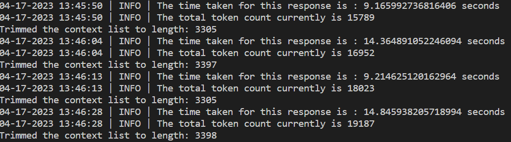
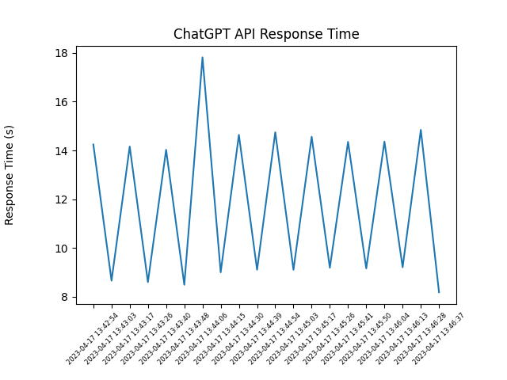

# ChatGPTDevFriendly


This package can be used by developers to quickly develop ChatGPT applications with the robustness 
and boilerplate code being taken care of by this wrapper.

## Requirements 
`pip install openai`

## Usage 

All the source code is currently in `src` directory and also in `tests` with sample usage in `test_main.py`. You will need an [OpenAI key](https://platform.openai.com/account/api-keys
) to use this. 

```python
chatgpt_client = ChatGptSmartClient(openai_api_key, model_name)
# We can query with some previous context and also decide whether to add a prompts answer to the context
prompt="List the top 10 upcoming startups in India?"
response, response_id = chatgpt_client.query(prompt, w_context=True, add_to_context=True)
print(f"The answer from ChatGPT is {response}")

# We build on previous context but do not add the current prompts answer to context
prompt="Ok thanks, can you give me the valuation of these startups in tabular format"
response  = chatgpt_client.query(prompt, w_context=True, add_to_context=False)
...

```

## Features


- [x] Save Conversations to a file
- [x] Resume conversations by loading context from a file. 
- [x] Retry logic in case of API failures.
- [x] Regular Trimming of context to 4000 tokens so that limit of 4097 is not breached. 
- [x] Total token and token vs time metric. 


- Retries: This is incase of failures like connection based request exceptions, API errors.
```
    (openai) C:\Users\Srinivas\OneDrive\Desktop\StartupSearchGPT\tests>python test_main.py
    Error occurred: API error , please try later
    Retrying after 3 seconds...
    Error occurred: API error , please try later
    Retrying after 6 seconds...
    Error occurred: API error , please try later
    Retrying after 12 seconds...
    Error occurred: API error , please try later
``` 
- Context trimming: Context is trimmed as needed when the limit breaches 4000 tokens. 


- Tracking metrics such as average time per response and total token usage.
```
    04-10-2023 10:26:44 | INFO | The time taken for this response is : 7.85 seconds

    04-10-2023 10:34:34 | INFO | The total tokens used up-till now is: 665
    04-10-2023 10:34:34 | INFO | The average response time is: 10.28 sec
```


```python
    chatgpt_client.print_metrics()
```
- Erasing Context: We can erase all previous chat history to star from fresh.
```python
    chatgpt_client.erase_history()
```
- Rollback: we can rollback to a particular Chatresponse context to an restart from there.
```python
    chatgpt_client.rollback_conversation(response_id)
```

- Embeddings: We can get the query embeddings and cache them for further use. (In developement)
```python
    chatgpt_client.get_embeddings()
```

## Contributions

This project is meant to make the chatgpt developer life easy, so please do add any featues you feel is needed! Also if you fnd it useful please leave a star!! 
